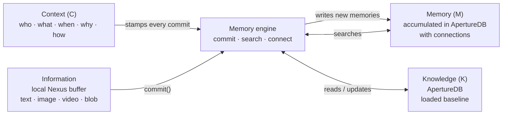

# aperture-nexus

**The Cognition Engine for Enterprise AI.**

aperture-nexus enables AI workflows, agents, and the humans working
alongside them to establish context, capture knowledge across text,
images, audio, video, and more — and commit it to memory for search
and retrieval, powered by [ApertureDB](https://aperturedata.io)'s
vector search and knowledge graph.


---

## How It Works

The KMC model reflects how enterprises actually work with knowledge.
**Knowledge** is the stable baseline in ApertureDB — catalogs,
policies, historical facts. **Memory** is the new
information Nexus commits to ApertureDB — stored traces with graph
connections, accumulating over time; think human memory, the traces
themselves, not the act. **Context** — who, what, when, why, and how
— is stamped on every commit and frames retrieval so the right
knowledge or memory surfaces for the right situation.



| KMC | Concept | In code / storage |
|-----|---------|-------------------|
| **K** | Loaded baseline in ApertureDB, shared across the organization | ApertureDB corpus; read via `Memory` |
| **M** | New information committed to ApertureDB — stored traces with graph connections, accumulating over time | `Memory` engine class writes; `Information` is the staging buffer |
| **C** | Who, what, when, why, and how — the retrieval frame | `Context` |

The same model works for a single developer session, a multi-agent
pipeline, or a human+AI team sharing context across an enterprise.

---

## Quick Start

Try the interactive walkthrough in one command — no setup needed:

```bash
git clone https://github.com/aperturedata/aperture-nexus
cd aperture-nexus
docker compose --profile demo run --rm nexus-demo
```

Or jump straight to [Getting Started](getting-started.md) to build
your own integration.

---

## Pages

| Page | What it covers |
|------|----------------|
| [Concepts](concepts.md) | KMC model, core objects, sessions, storage mapping |
| [Getting Started](getting-started.md) | Step-by-step to your first stored memory |
| [API Reference](api-reference.md) | `Memory`, `Context`, `Information`, `MemoryTask` |
| [Configuration](configuration.md) | Every field in `aperture_nexus.json` |
| [Customer Support Agent](customer-support-agent.md) | Multi-agent pipeline with multimodal memory and semantic image search |

See [`examples/`](https://github.com/aperturedata/aperture-nexus/tree/main/examples)
for runnable scripts covering each data modality.
