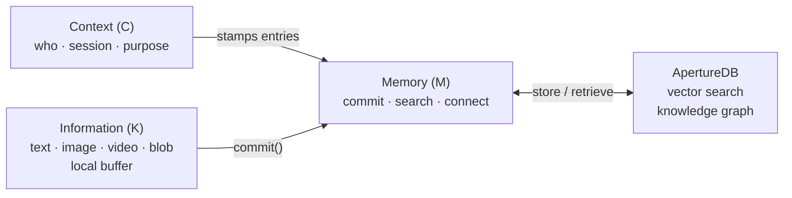

# aperture-nexus

**The Cognition Engine for Enterprise AI.**

aperture-nexus enables AI workflows, agents, and the humans working
alongside them to establish context, capture knowledge across text,
images, audio, video, and more — and commit it to memory for search
and retrieval, powered by [ApertureDB](https://aperturedata.io)'s
vector search and knowledge graph.


---

## How It Works

The KMC model reflects how enterprises work with knowledge: existing
Knowledge is captured via `Information`, `Memory` stores and retrieves
it, and `Context` tells Memory who is acting and why so the right
knowledge comes back.



| KMC | Object | Role |
|-----|--------|------|
| **K** | `Information` | Local buffer — nothing written to DB until commit |
| **M** | `Memory` | Commits, processes embeddings, connects, and searches |
| **C** | `Context` | Who is acting, in which session, and why — scopes retrieval |

The same model works for a single developer session, a multi-agent
pipeline, or a human+AI team sharing context across an enterprise.

---

## Quick Start

Try the interactive walkthrough in one command — no setup needed:

```bash
git clone https://github.com/vishakha041/aperture-nexus
cd aperture-nexus
docker compose --profile demo run --rm nexus-demo
```

Or jump straight to [Getting Started](getting-started.md) to build
your own integration.

---

## Pages

| Page | What it covers |
|------|----------------|
| [Concepts](concepts.md) | KMC model, core objects, sessions, storage mapping |
| [Getting Started](getting-started.md) | Step-by-step to your first stored memory |
| [API Reference](api-reference.md) | `Memory`, `Context`, `Information`, `MemoryTask` |
| [Configuration](configuration.md) | Every field in `aperture_nexus.json` |

See [`examples/`](https://github.com/vishakha041/aperture-nexus/tree/main/examples)
for runnable scripts covering each data modality.
