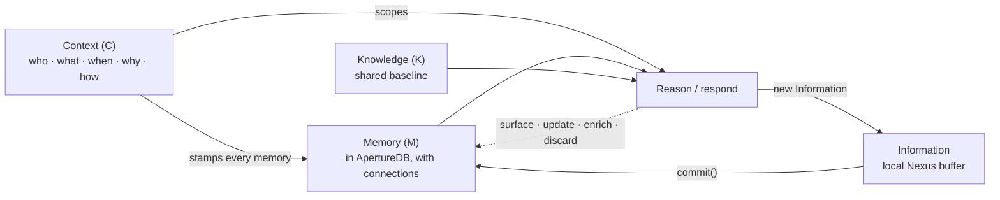

# aperture-nexus

**The Cognition Engine for Enterprise AI.**

aperture-nexus enables AI workflows, agents, and the humans working
alongside them to establish context, capture knowledge across text,
images, audio, video, and more — and commit it to memory for search
and retrieval, powered by [ApertureDB](https://aperturedata.io)'s
vector search and knowledge graph.


---

## How It Works

The KMC model is not three static concepts. It is a loop: new
`Information` arrives with a `Context`, becomes a `Memory` when
committed, and later drives retrieval that reasons across Memory
and `Knowledge` together. Results produce new Information, and the
loop continues.

- **Knowledge (K)** — the general facts and relationships that
  don't change moment to moment. A shared baseline in ApertureDB.
- **Memory (M)** — the specific trace of what happened in a
  particular interaction, accumulated over time from new commits.
- **Context (C)** — the who, what, when, why, and how that makes
  a fact meaningful rather than merely retrievable.



**Cognition** is what this loop enables: retrieval scoped to the
situation, reasoning that draws on both durable facts and recent
experience, and the ability to surface, update, or discard what an
agent is relying on as new evidence arrives. The dashed edges are
the **cognition hooks** — where a domain-specific layer or a human
keeps the loop honest.

The same model works for a single developer session, a multi-agent
pipeline, or a human+AI team sharing context across an enterprise.
Parallels to human memory (K as durable general knowledge, M as
recallable experience, working memory on the v2 roadmap) are a
useful mnemonic, not the product.

---

## Quick Start

Try the interactive walkthrough in one command — no setup needed:

```bash
git clone https://github.com/aperturedata/aperture-nexus
cd aperture-nexus
docker compose --profile demo run --rm nexus-demo
```

Or jump straight to [Getting Started](getting-started.md) to build
your own integration.

---

## Pages

| Page | What it covers |
|------|----------------|
| [Concepts](concepts.md) | KMC model, core objects, sessions, storage mapping |
| [Getting Started](getting-started.md) | Step-by-step to your first stored memory |
| [API Reference](api-reference.md) | `Memory`, `Context`, `Information`, `MemoryTask` |
| [Configuration](configuration.md) | Every field in `aperture_nexus.json` |
| [Customer Support Agent](customer-support-agent.md) | Multi-agent pipeline with multimodal memory and semantic image search |

See [`examples/`](https://github.com/aperturedata/aperture-nexus/tree/main/examples)
for runnable scripts covering each data modality.
