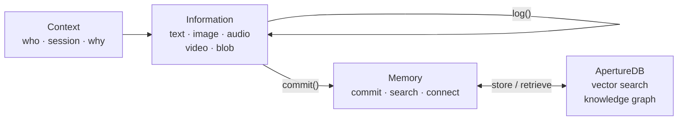

# aperture-nexus

**The Cognition Engine for Enterprise AI.**

aperture-nexus enables AI workflows, agents, and the humans working alongside
them to establish context, capture knowledge across text, images, audio, video,
and more — and commit it to memory for search and retrieval, powered by
[ApertureDB](https://aperturedata.io)'s vector search and knowledge graph.


---

## How It Works

Three objects form the KMC model and work together as a complete cognition layer:



| Object | Role |
|--------|------|
| **Context** | Who is doing what, in which session, and why — carries identity and intent |
| **Information** | Local buffer for multimodal inputs; nothing written to the DB until commit |
| **Memory** | The engine: commits, processes embeddings, connects memories, and searches |

The same model works for a single developer session, a multi-agent pipeline,
or a human+AI team sharing context across an enterprise.

---

## Quick Start

Try the interactive walkthrough in one command — no setup needed:

```bash
git clone https://github.com/aperturedata/aperture-nexus
cd aperture-nexus
docker compose --profile demo run --rm nexus-demo
```

Or jump straight to [Getting Started](getting-started.md) to build your own integration.

---

## Pages

| Page | What it covers |
|------|----------------|
| [Concepts](concepts.md) | The KMC model, core objects, sessions, ApertureDB storage mapping |
| [Getting Started](getting-started.md) | Step-by-step from zero to your first stored and searchable memory |
| [API Reference](api-reference.md) | Full reference for `Memory`, `Context`, `Information`, `MemoryTask`, and exceptions |
| [Configuration](configuration.md) | Every field in `aperture_nexus.json` with defaults and environment variable overrides |

See [`examples/`](https://github.com/aperturedata/aperture-nexus/tree/main/examples) for runnable scripts covering each data modality.
