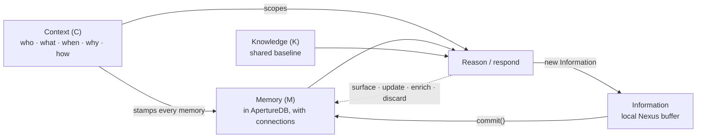

# aperture-nexus

**The Cognition Engine for Enterprise AI.**

aperture-nexus enables AI workflows, agents, and the humans working
alongside them to establish context, capture knowledge across text,
images, audio, video, and more, and commit it to memory for search
and retrieval, powered by [ApertureDB](https://aperturedata.io)'s
vector search and knowledge graph.


---

## Why Nexus

Most memory tools treat agent interactions as disconnected text chunks
in a vector store. Nothing carries over: not the reasoning, not the
context, not what actually happened last time. Existing knowledge bases
get missed, and the original source of information gets lost.

Nexus is the memory layer built on ApertureDB, the unified graph,
vector, and multimodal database already running in production. Here is
what changes when you use it.

**Continuity across sessions and tools.** One shared memory backbone
for every session, tool, and teammate on the same principal. Your
Claude Code session from this morning, your Cursor session at lunch,
your teammate joining the project tomorrow all see the same
accumulated Knowledge and Memory.

**Vector search plus knowledge graph, not vectors alone.** Vector
search returns the top-K semantically similar chunks and stops. Nexus
adds the knowledge graph on top, in the same store. Context (who,
what, when, why, and how) is stamped on every commit; existing
Knowledge lives alongside. Retrieval combines vector similarity with
graph structure, so what comes back is not just "closest in embedding
space" but the specific Memory plus the Knowledge and Context that
together form the cognitive basis for answering the question. This
mirrors how human memory works: recall is scoped by the situation you
are in (Context) and connected to what you already know (Knowledge),
not just what feels similar to whatever you are thinking about.

**Lineage on demand.** Every commit's origin is right there in the same
graph. Trace a memory back to the interaction that produced it, spot
duplicates by source, audit what the agent has been relying on.
Available when you want it, out of the way when you don't.

**Team and department scale.** Adding a user is one call:
`NexusAdmin.create_principal(user_id=..., organization=...,
department=...)`. Every memory carries the principal, organization, and
department that created it, and search scopes by that frame
automatically. One memory backbone across the company, not a silo per
tool or per person.

**Security and privacy.** Admin credentials live only where principals
are created, never in application code. Every operation enforces the
caller's permissions. Self-host on Docker Compose or Kubernetes, or run
on a cloud ApertureDB instance under your control. No third-party
service sees your memories or your queries.

**Ready for whatever your work adds next.** Text today; documents,
images, video, audio, or structured records whenever your agents need
them. Same store, same graph, same API. The capability is already there
because ApertureDB is what backs Nexus. No second stack to bolt on, no
migration when your work grows past chat logs.

---

## How It Works

The KMC model is not three static concepts. It is a loop: new
`Information` arrives with a `Context`, becomes a `Memory` when
committed, and later drives retrieval that reasons across Memory
and `Knowledge` together. Results produce new Information, and the
loop continues.

- **Knowledge (K)**: the general facts and relationships that
  don't change moment to moment. A shared baseline in ApertureDB.
- **Memory (M)**: what was captured in a particular interaction
  (a document, notes, an image, a fact), accumulated over time
  from new commits.
- **Context (C)**: the who, what, when, why, and how that makes
  a fact meaningful rather than merely retrievable.


```mermaid
flowchart LR
    C["Context (C)\nwho · what · when · why · how"]
    I["Information\nlocal Nexus buffer"]
    M["Memory (M)\nin ApertureDB, with connections"]
    K["Knowledge (K)\nshared baseline"]
    R["Reason / respond"]

    I -->|"commit()"| M
    C -->|"stamps every memory"| M
    C -->|"scopes"| R
    M --> R
    K --> R
    R -->|"new Information"| I
    R -.->|"surface · update · enrich · discard"| M
```

**Cognition** is what this loop enables: retrieval scoped to the
situation, reasoning that draws on both durable facts and recent
experience, and the ability to surface, update, or discard what an
agent is relying on as new evidence arrives. The dashed edges are
the **cognition hooks**, where a domain-specific layer or a human
keeps the loop honest.

The same model works for a single developer session, a multi-agent
pipeline, or a human+AI team sharing context across an enterprise.
Parallels to human memory (K as durable general knowledge, M as
recallable experience, working memory on the v2 roadmap) are a
useful mnemonic, not the product.

---

## Quick Start

Try the interactive walkthrough in one command, no setup needed:

```bash
git clone https://github.com/aperture-data/aperture-nexus
cd aperture-nexus
docker compose --profile demo run --rm nexus-demo
```

Or jump straight to [Getting Started](getting-started.md) to build
your own integration.

---

## Pages

| Page | What it covers |
|------|----------------|
| [Concepts](concepts.md) | KMC model, core objects, sessions, storage mapping |
| [Getting Started](getting-started.md) | Step-by-step to your first stored memory |
| [API Reference](api-reference.md) | `Memory`, `Context`, `Information`, `MemoryTask` |
| [Configuration](configuration.md) | Every field in `aperture_nexus.json` |
| [Coding Assistant with Continuity](coding-assistant.md) | Text-only worked example: one principal, three sessions, continuity across days and tools |
| [Customer Support Agent](customer-support-agent.md) | Multi-agent pipeline with memories spanning text, images, and semantic image search |

See [`examples/`](https://github.com/aperture-data/aperture-nexus/tree/main/examples)
for runnable scripts covering each data modality.

---

## Related Resources

Longer-form writing on the ideas behind aperture-nexus:

- [Introducing Aperture Nexus: Multimodal Memory](https://www.aperturedata.io/resources/introducing-aperture-nexus-multimodal-memory) — launch post, the KMC model, and the cognition stack.
- [AI Memory & Cognition: The Architect's Playbook](https://www.aperturedata.io/resources/ai-memory-cognition-the-architects-playbook) — design patterns for enterprise AI memory.
- [AI Memory & Cognition Landscape Deep Dive](https://www.aperturedata.io/resources/ai-memory-cognition-landscape-deep-dive) — where existing tools sit and what is missing.
- [The Spectrum of Machine Cognition: Evaluating Frameworks (Part 2A)](https://www.aperturedata.io/resources/the-spectrum-of-machine-cognition-evaluating-frameworks-part2-a) — how to compare cognition frameworks.
- [Human Memory: The Perfect Template for AI Memory](https://www.aperturedata.io/resources/human-memory-the-perfect-template-for-ai-memory) — the biological analogy that shaped KMC.
- [Context Graphs: Their Implementation, Human Judgment & Machine Agency](https://www.aperturedata.io/resources/context-graphs-their-implementation-human-judgment-machine-agency) — Context as a first-class citizen.

Podcast — *The Cognitive Layer*:

- [Episode 1: Himanshu (Netflix)](https://www.aperturedata.io/resources/the-cognitive-layer-episode1-himanshu-netflix)
