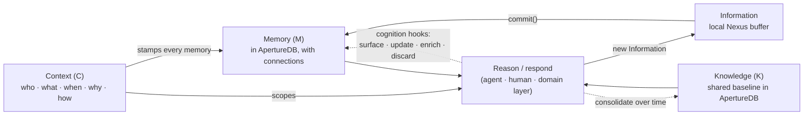
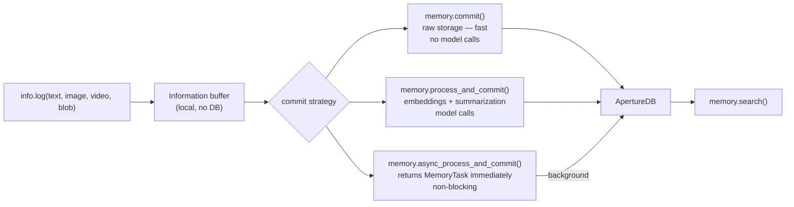
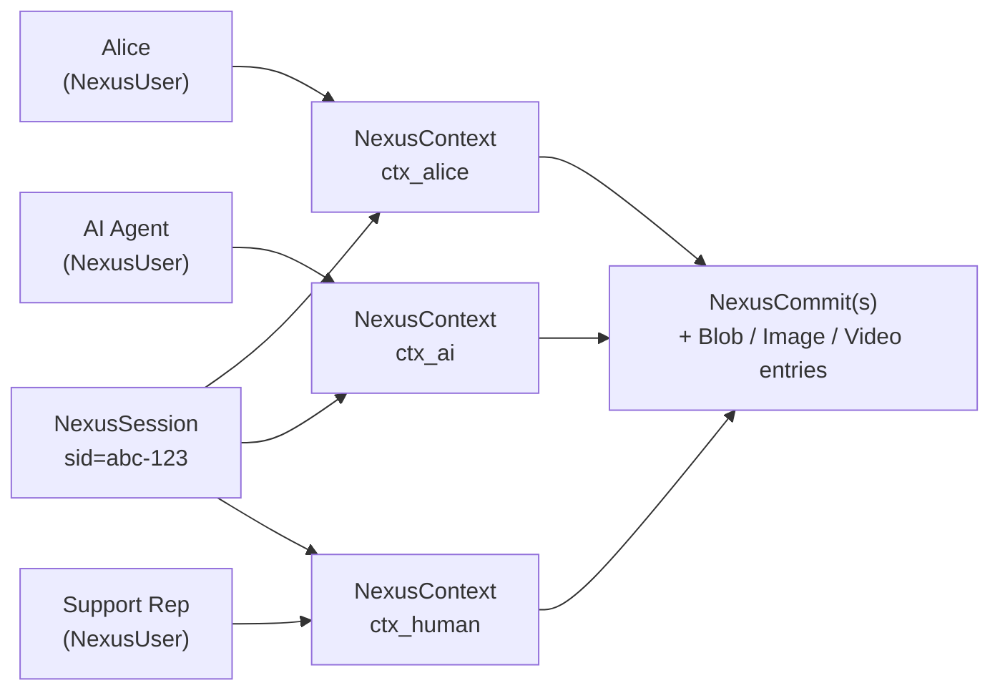
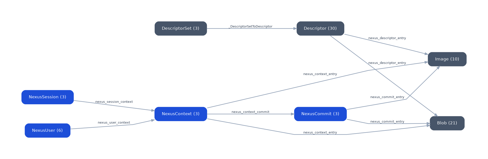

# Concepts

aperture-nexus is the cognition engine for enterprise AI. It is built
around the **KMC model**: three concepts that together let a system
remember, retrieve, and reason continuously, the way real teams work.

- **Knowledge (K)**: the general facts and relationships that don't
  change moment to moment, such as catalogs, policies, historical
  records, and past decisions. A shared baseline held in ApertureDB,
  extended or refreshed from external sources over time.
- **Memory (M)**: what was captured in a particular interaction:
  a document, notes, an image, or any information committed via
  Nexus, along with when, with whom, and why. Just like human
  memory, it can be any kind of content, not a step-by-step log.
  Each memory is durable and carries its own graph connections.
  `Memory` (the Python class) is that store and its interface, and
  `memory.commit(ctx, info)` adds a new one.
- **Context (C)**: the who, what, when, why, and how that makes a
  fact meaningful rather than merely retrievable. Stamped on every
  memory so retrieval can be scoped precisely.

### The KMC Loop

KMC is not three static buckets. It runs as a loop:

1. New `Information` arrives with a `Context` (an agent observes, a
   customer opens a ticket, a workflow triggers).
2. Committing turns Information into a `Memory` in ApertureDB, with
   Context stamped on it and graph connections in place.
3. When the next question comes in, its Context frames a search
   across Memory and Knowledge together, pulling only what is
   relevant to the situation.
4. The results are reasoned over and acted on (by an agent, a human,
   or a domain-specific layer), often producing new Information such
   as a response, a decision, or an updated fact.
5. That new Information becomes new Memory. Some memories eventually
   harden into Knowledge; others get discarded as they age or turn
   out to be wrong. The loop continues.

**Cognition** is what this loop enables. Not just storage, not just
retrieval: the ability to accumulate experience, connect it to
shared facts, notice contradictions, surface what an agent is
actually relying on, and update or discard beliefs as new evidence
arrives. The **cognition hooks** (*surface*, *update*, *enrich*,
*discard*) are where a domain-specific layer or a human intervenes
to keep the loop honest. Nexus provides the substrate; the judgment
layer sits above.

The Python API objects mirror the KMC concepts directly. `Information`
is the local Nexus buffer where new content is staged before it
becomes a memory; `Memory` is the persistent store and its interface
(the only component that reads or writes ApertureDB); `Context` is
the frame Nexus stamps on every commit. This page explains what
each represents, how they relate, and how they map to ApertureDB's
storage primitives.

> **Parallel to human memory:** a useful mnemonic, not the product.
> Knowledge is akin to durable general knowledge, Memory to specific
> recallable experiences, and a short-term / working memory layer
> (search, dedup, consolidate before commit) is on the v2 roadmap.

---

## The Three Core Objects

### Information: The Staging Buffer

`Information` is a **local, client-side buffer** where new multimodal
content is staged before it becomes a memory. It is a Nexus concept:
nothing is written to ApertureDB until `memory.commit()` or
`memory.process_and_commit()` is called. On commit, the buffered
entries become memories stored in the graph alongside the baseline
Knowledge and searched together with it.

Inputs are added via `Information.log()`, which validates and
normalizes each entry immediately, so errors surface at log time, not
during commit.

You can commit incrementally during a long session rather than
buffering everything until the end. Each `memory.commit(ctx, info)`
call flushes the current buffer and returns; you can continue logging
to the same `info` object and commit again later. If a commit fails,
the buffer is preserved so you can retry without losing entries.

Supported input types:

| Modality | Accepted forms |
|----------|---------------|
| Text | `str` |
| Image | file path, URL, `bytes`, PIL `Image`, `numpy.ndarray` |
| Video | file path, URL, `bytes` |
| Blob | file path, URL, `bytes`; requires `document_type` (e.g. `"pdf"`, `"mp3"`, `"docx"`) |
| Embedding | `numpy.ndarray` + `embedding_model` (skips model call) |

Note that `image` and `video` accept paths and URLs (content is read
at commit time), while `blob` also accepts a file path as a
convenience. If you want to store a reference only (e.g. a URL you
don't want fetched), use `text` or a custom `metadata` field.

> **Blobs are stored opaquely in v1.** Nexus does not extract text
> from documents (pdf, docx, csv, etc.) and does not embed blob
> content on its own. Calling `process_and_commit()` on a blob-only
> entry raises `NexusConfigError`. To make a document semantically
> searchable, either extract the text upstream and log it with the
> blob (`info.log(text=..., blob=..., document_type=...)`), pre-compute
> an embedding and pass it in (`info.log(blob=..., embedding=..., embedding_model=...)`),
> or use `memory.commit()` for opaque storage searchable by metadata
> only. Native document extraction is planned for a future release.

### Memory: The Accumulated Layer

`Memory` is the M in KMC: what was captured in a particular
interaction, meaning any information committed via Nexus (a document,
notes, an image, a video, a fact) along with when, with whom, and
why. In the API and in ApertureDB it is the same thing.
New `Information` becomes a memory when committed; each memory is
durable and carries its own graph connections to the `NexusContext`
that authored it and the `NexusCommit` it was part of. Memories
accumulate over time and are searched together with Knowledge.

`Memory` (the Python class) is the interface to this store and the
only component that reads or writes ApertureDB. Every other object
in the API is a pure data object. Through this one interface you:

- Authenticate principals
- Commit new memories (`memory.commit()`, `memory.process_and_commit()`)
- Link contexts to one another with user-defined named relationships
  (`memory.connect()`; the underlying `nexus_link` edge is Context to
  Context in v1)
- Search across memories and Knowledge with permission enforcement

### Context: The Retrieval Frame

A `Context` captures **who, what, when, why, and how**: the C in KMC.
It is a pure data object; it never writes to ApertureDB. Nexus stamps
every commit with its Context properties so retrieval can be scoped
to the right participants, sessions, and purposes, turning raw
storage into meaningful cognition.

Key properties:

- `principal`: the authenticated user or agent performing this action
- `session_id` / `session_name`: which session this context belongs
  to
- `purpose`: the task or intent behind this interaction, expressed
  as a short phrase (e.g. `"debug failing export"`,
  `"Q3 budget review"`, `"customer support ticket #4821"`). Stored
  as metadata and filterable at search time.
- `organization`: optional group scope for permission and search
  filtering
- `restrictions`: optional local or global constraints that affect
  what this context can read and write

**Why `purpose` matters:** it is the signal that lets Memory retrieve
knowledge in the right context. `search(filters={"purpose":
"customer support"})` returns only entries where that purpose was set;
without it, results are scoped only by session or organization.
Think of it as tagging every log entry with the task it was part of.

---

## How the Three Objects Relate



The solid edges are v1 behavior. The dashed edges are the cognition
hooks: today they run via explicit `memory.commit()` and
`memory.remove()` calls made by the reasoning layer; automatic
consolidation and decay are on the roadmap.

---

## Processing Flow

`Information.log()` accepts raw inputs and validates them locally.
The call to `memory.commit()` decides how they are stored.



Use `commit()` when you need speed and will rely on metadata-only
search. Use `process_and_commit()` when you need semantic (vector)
search across the stored content.

### Clearing and Updating the Buffer

Before committing, you can clean up the `Information` buffer. All removal methods affect only the local buffer; nothing is written to or deleted from ApertureDB.

**By reference:** `log()` returns an `InformationEntry`. Hold it and pass it back to `remove()`:

```python
draft = info.log(text="preliminary draft")
info.log(text="final version")
info.remove(draft)       # discard the draft; only "final version" commits
memory.commit(ctx, info)
```

**By tag:** label a group of related entries at log time, then discard the whole group:

```python
info.log(text="Order #4412 placed", tag="order-4412")
info.log(blob=receipt, document_type="pdf", tag="order-4412")
if order_cancelled:
    info.remove_tagged("order-4412")   # both entries removed atomically
```

**By timestamp**, two patterns:

```python
from datetime import datetime, timezone

# Rollback: undo everything logged since a checkpoint
checkpoint = datetime.now(timezone.utc)
info.log(text="attempt A")
info.log(image="draft.png")
# … something went wrong …
info.remove_since(checkpoint)   # only entries before the checkpoint remain

# Cleanup: discard old staged entries, keep recent ones
cutoff = datetime.now(timezone.utc) - timedelta(hours=1)
info.remove_before(cutoff)
```

**Everything:** abandon the whole buffer and start over:

```python
info.log(text="wrong context, discard all of this")
info.remove_all()
info.log(text="fresh start")
memory.commit(ctx, info)   # only "fresh start" is stored
```

### Memories Are Append-Only in v1

`commit()` always adds new entries; there is no in-place update. If
you commit the same context twice you get more entries, not replaced
ones. `memory.remove()` deletes committed content at multiple levels of granularity: by `commit_id` (one commit), `context_id` (all of a context's content), `session_id` (entire session), timestamp (`before=`/`since=`), or by passing `SearchResult` objects from a prior search.
`Memory.update()` with a `superseded_by` lineage edge for partial
updates is planned for v2.

---

## Search Results

`memory.search()` returns a flat `list[SearchResult]`, one item per
stored entry or text chunk, ordered by descending similarity score.
Each result carries:

- `score`: similarity score (higher = more similar;
  1.0 for metadata-only results)
- `text`: inline text content (for text entries)
- `modality`: `"text"` | `"image"` | `"video"` | `"blob"`
- `context_id`, `session_id`, `user_id`, `created_at`: provenance
- `start_frame`, `stop_frame`: video clip boundaries (video only)
- `metadata`: any custom properties stored at log time

**There is no LLM summarization in v1.** If a long document was
chunked into five pieces at commit time, a matching search may return
up to five separate results, one per chunk. Grouping by context,
ranking by session recency, and LLM-based consolidation of results
are planned for v2.

For now, the typical pattern is to pass the results directly to your
LLM as retrieved context:

```python
results = memory.search(
    query="missing order",
    filters={"organization": "acme"},
)
context_block = "\n".join(r.text for r in results if r.text)
# Pass context_block to your LLM prompt
```

---

## Sessions and Participants

Sessions in aperture-nexus are **many-to-many with participants**: one
session can have multiple contributors (AI agents, automated
pipelines, and human collaborators), and one participant can belong to
multiple sessions.

Each participant gets their own `Context` into a shared session.
Attribution is implicit; every piece of `Information` is linked to
the `Context` that logged it.



Searching with `filters={"session_id": sid}` returns memories from
all participants in that session.

The same participant can also be in multiple sessions simultaneously,
for example an AI agent handling concurrent support tickets, or a
data pipeline that logs to separate sessions per data source.

---

## ApertureDB Storage Mapping

aperture-nexus is a semantic layer on top of ApertureDB's native
storage primitives. The table below shows how aperture-nexus concepts
map to ApertureDB objects. See the
[ApertureDB documentation](https://docs.aperturedata.io) for a full
reference on these primitives.

| aperture-nexus | ApertureDB primitive | Notes |
|----------------|---------------------|-------|
| Principal / User | `Entity` (`NexusUser`) | One per `user_id` |
| Session | `Entity` (`NexusSession`) | Shared across participants |
| Context | `Entity` (`NexusContext`) | session_id, purpose, org |
| User → Context | `Connection` (`nexus_user_context`) | Principal authored this context |
| Session → Context | `Connection` (`nexus_session_context`) | Context belongs to session |
| Commit | `Entity` (`NexusCommit`) | One per `commit()` call; groups all entries written together |
| Context → Commit | `Connection` (`nexus_context_commit`) | Context owns its commits |
| Commit → entry | `Connection` (`nexus_commit_entry`) | Tracks what was written per commit; enables `remove(commit_id=...)` |
| Context → entry | `Connection` (`nexus_context_entry`) | Direct edge for fast context-scoped traversal |
| Text (chunked) | `Blob` + `Descriptor` per chunk | Embedding in DescriptorSet |
| Image | `Image` + `Descriptor` | ApertureDB native Image type |
| Video | `Video` → `Clip` entities → `Descriptor` | Per clip |
| Blob (pdf, mp3…) | `Blob` with `document_type` | Raw bytes; no embedding |
| Pre-computed embedding | `Descriptor` directly | Model recorded as property |
| MemoryTask | in-memory object | Async status tracking (not persisted) |

The graph below shows the schema as it appears in ApertureDB after a
commit. Blue nodes are aperture-nexus entities, slate nodes are
ApertureDB native storage primitives:



### DescriptorSets

ApertureDB requires a **DescriptorSet** before any vectors can be
stored or searched. aperture-nexus creates and manages DescriptorSets
automatically based on the `embedding_model` name. Each unique model
name gets its own DescriptorSet.

This means:
- `process_and_commit()` requires at least one model configured in
  `aperture_nexus.json`
- Pre-computed embeddings passed via
  `info.log(embedding=..., embedding_model="...")` also require an
  existing or new DescriptorSet
- Mixing models across calls is supported; each gets its own set

### ApertureDB Web UI

ApertureDB ships with its own web UI at `http://localhost:8087` (when
running via `docker compose up -d` or the demo). It shows raw ApertureDB objects
(Entities, Connections, Images, Videos, Descriptors), not
aperture-nexus concepts. It is useful for:
- Verifying that aperture-nexus is storing data correctly
- Debugging schema issues
- Inspecting DescriptorSets and their dimensions

A higher-level aperture-nexus UI showing sessions, contexts,
memories, and search results is planned for a future release.

---

## Knowledge Graph

Contexts can be connected to one another with named relationships
using `memory.connect()`. This adds a `nexus_link` edge between two
`NexusContext` entities and builds a traversable knowledge graph on
top of ApertureDB's `Connection` primitive.

```python
memory.connect(source=ctx_q1, target=ctx_q2, relationship="follows")
memory.connect(
    source=ctx_id_1,
    target=ctx_id_2,
    relationship="related_to",
)
```

Memory-to-memory (commit-to-commit, blob-to-blob) linking is not part
of v1. To associate specific memories, link the `NexusContext`
entities that authored them; the automatic
`nexus_context_commit` and `nexus_commit_entry` edges then let a
traversal reach the individual memories from either side.

Graph traversal in `memory.search()` (via `max_hops` and relationship
filters) is planned for a future release. The underlying ApertureDB
`Connection` objects are created now and will be queryable once
traversal is implemented.

---

## Security Model

- **No root required**: all paths and ports are user-accessible
- **Credentials via environment**: `APERTUREDB_KEY` or
  `APERTUREDB_JSON`; never hardcoded in config or source
- **Permission enforcement**: all operations check the caller's
  `Principal`; restrictions on a `Context` affect what it can
  read and write
- **UI local by default**: the aperture-nexus UI binds to
  `127.0.0.1`; network access requires an explicit `api_key` set
  via `APERTURE_NEXUS_UI_API_KEY`
