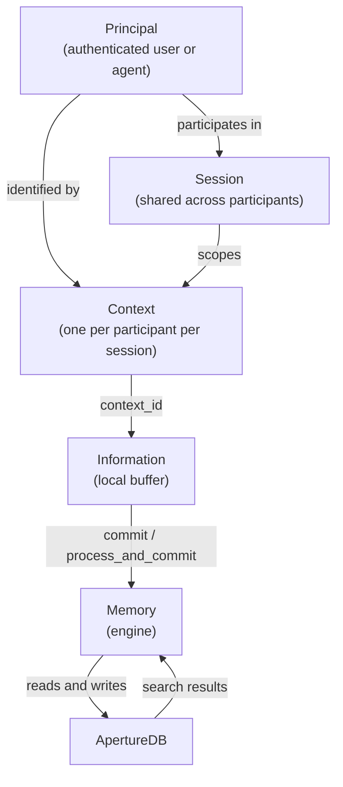
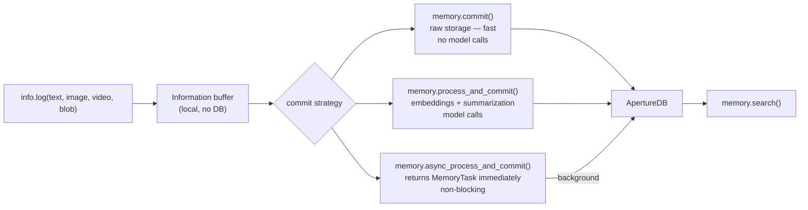
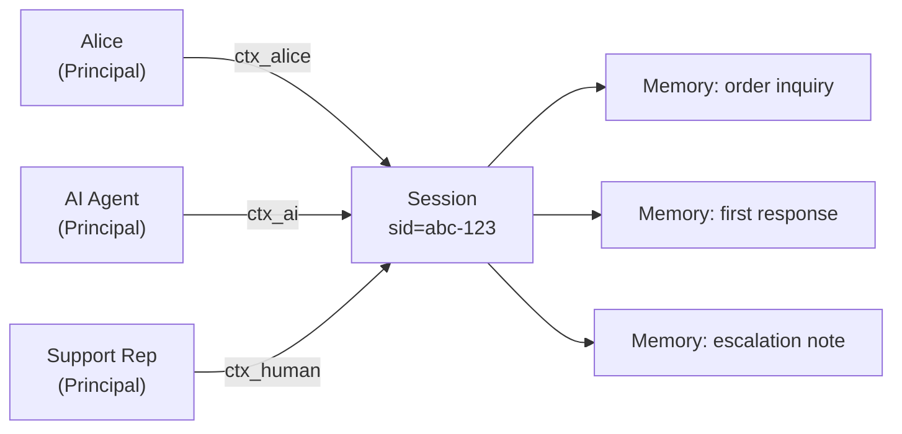

# Concepts

aperture-nexus is the cognition layer for enterprise AI. AI workflows,
agents, and the humans working alongside them use it to establish
context, capture multimodal knowledge, and commit it to memory for
retrieval when needed. It is built around three objects —
**Context**, **Information**, and **Memory** — that together implement
the KMC (Knowledge, Memory, Context) model. This page explains what
each object represents, how they relate, and how they map to
ApertureDB's storage primitives.

---

## The Three Core Objects

### Context

A `Context` captures **who is doing what, in which session, and why**.
It carries identity, session membership, and intent — but holds no
data of its own.

Key properties:
- `principal` — the authenticated user or agent performing this action
- `session_id` / `session_name` — which session this context belongs to
- `purpose` — why this interaction is happening
  (e.g. `"Customer reporting missing order"`)
- `organization` — optional group scope for permission and search
- `restrictions` — optional local or global constraints that affect
  what this context can access

A context does not write to ApertureDB directly. `Memory` uses it as
metadata when committing and enforces it during search.

### Information

`Information` is a **local buffer for multimodal inputs** accumulated
during a session. Nothing is written to ApertureDB until
`memory.commit()` or `memory.process_and_commit()` is called.

Inputs are added via `Information.log()`, which validates and
normalizes each entry immediately — so errors surface at log time,
not later during commit.

You can commit incrementally during a long session rather than
buffering everything until the end. Each `memory.commit(ctx, info)`
call flushes the current buffer and returns — you can then continue
logging to the same `info` object and commit again later. If a commit
fails, the buffer is preserved so you can retry without losing any
entries.

Supported input types:

| Modality | Accepted forms |
|----------|---------------|
| Text | `str` |
| Image | file path, URL, `bytes`, PIL `Image`, `numpy.ndarray` |
| Video | file path, URL, `bytes` |
| Blob | file path, URL, `bytes` + `document_type` (e.g. `"pdf"`, `"mp3"`, `"docx"`) |
| Embedding | `numpy.ndarray` + `embedding_model` (skips model call) |

### Memory

`Memory` is the **central engine**. It is the only component that
writes to ApertureDB. It:
- Authenticates principals
- Commits and processes `Information` into durable storage
- Connects memories and contexts with named relationships
- Searches across stored memories with permission enforcement

---

## How the Three Objects Relate



---

## Processing Flow

`Information.log()` accepts raw inputs and validates them locally.
The call to `memory.commit()` decides how they are stored.



Use `commit()` when you need speed and will rely on metadata-only
search. Use `process_and_commit()` when you need semantic (vector)
search across the stored content.

### Clearing and updating the buffer

Before committing, you can clean up the `Information` buffer. All removal methods affect only the local buffer — nothing is written to or deleted from ApertureDB.

**By reference** — `log()` returns an `InformationEntry`. Hold it and pass it back to `remove()`:

```python
draft = info.log(text="preliminary draft")
info.log(text="final version")
info.remove(draft)       # discard the draft; only "final version" commits
memory.commit(ctx, info)
```

**By tag** — label a group of related entries at log time, then discard the whole group:

```python
info.log(text="Order #4412 placed", tag="order-4412")
info.log(blob=receipt, document_type="pdf", tag="order-4412")
if order_cancelled:
    info.remove_tagged("order-4412")   # both entries removed atomically
```

**By timestamp** — two patterns:

```python
from datetime import datetime, timezone

# Rollback: undo everything logged since a checkpoint
checkpoint = datetime.now(timezone.utc)
info.log(text="attempt A")
info.log(image="draft.png")
# … something went wrong …
info.remove_since(checkpoint)   # only entries before the checkpoint remain

# Cleanup: discard old staged entries, keep recent ones
cutoff = datetime.now(timezone.utc) - timedelta(hours=1)
info.remove_before(cutoff)
```

**Everything** — abandon the whole buffer and start over:

```python
info.log(text="wrong context — discard all of this")
info.remove_all()
info.log(text="fresh start")
memory.commit(ctx, info)   # only "fresh start" is stored
```

### Memories are append-only in v1

`commit()` always adds new entries — there is no in-place update. If
you commit the same context twice you get more entries, not replaced
ones. `memory.remove(memory_id)` deletes a committed memory entirely.
`Memory.update()` with a `superseded_by` lineage edge for partial
updates is planned for v2.

---

## Search Results

`memory.search()` returns a flat `list[SearchResult]` — one item per
stored entry or text chunk, ordered by descending similarity score.
Each result carries:

- `score` — similarity score (higher = more similar;
  1.0 for metadata-only results)
- `text` — inline text content (for text entries)
- `modality` — `"text"` | `"image"` | `"video"` | `"blob"`
- `context_id`, `session_id`, `user_id`, `created_at` — provenance
- `start_frame`, `stop_frame` — video clip boundaries (video only)
- `metadata` — any custom properties stored at log time

**There is no LLM summarization in v1.** If a long document was
chunked into five pieces at commit time, a matching search may return
up to five separate results — one per chunk. Grouping by context,
ranking by session recency, and LLM-based consolidation of results
are planned for v2.

For now, the typical pattern is to pass the results directly to your
LLM as retrieved context:

```python
results = memory.search(
    query="missing order",
    filters={"organization": "acme"},
)
context_block = "\n".join(r.text for r in results if r.text)
# Pass context_block to your LLM prompt
```

---

## Sessions and Participants

Sessions in aperture-nexus are **many-to-many with participants**: one
session can have multiple contributors — AI agents, automated
pipelines, and human collaborators — and one participant can belong to
multiple sessions.

Each participant gets their own `Context` into a shared session.
Attribution is implicit — every piece of `Information` is linked to
the `Context` that logged it.



Searching with `filters={"session_id": sid}` returns memories from
all participants in that session.

The same participant can also be in multiple sessions simultaneously
— for example an AI agent handling concurrent support tickets, or a
data pipeline that logs to separate sessions per data source.

---

## ApertureDB Storage Mapping

aperture-nexus is a semantic layer on top of ApertureDB's native
storage primitives. The table below shows how aperture-nexus concepts
map to ApertureDB objects. See the
[ApertureDB documentation](https://docs.aperturedata.io) for a full
reference on these primitives.

| aperture-nexus | ApertureDB primitive | Notes |
|----------------|---------------------|-------|
| Principal / User | `Entity` (`_nexus_class: "User"`) | One per `user_id` |
| Session | `Entity` (`_nexus_class: "Session"`) | Shared across participants |
| User ↔ Session | `Connection` (`participates_in`) | Many-to-many |
| Context | `Entity` (`_nexus_class: "Context"`) | session_id, purpose, org |
| Committed Memory | `Entity` (`_nexus_class: "Memory"`) | Links Context + entries |
| Text (chunked) | `Entity` + `Descriptor` per chunk | Embedding in DescriptorSet |
| Image | `Image` + `Descriptor` | ApertureDB native Image type |
| Video | `Video` → `Clip` entities → `Descriptor` | Per clip |
| Blob (pdf, mp3…) | `Blob` with `document_type` | Raw bytes; no embedding |
| Pre-computed embedding | `Descriptor` directly | Model recorded as property |
| MemoryTask | `Entity` (`_nexus_class: "MemoryTask"`) | Async status tracking |

### DescriptorSets

ApertureDB requires a **DescriptorSet** before any vectors can be
stored or searched. aperture-nexus creates and manages DescriptorSets
automatically based on the `embedding_model` name. Each unique model
name gets its own DescriptorSet.

This means:
- `process_and_commit()` requires at least one model configured in
  `aperture_nexus.json`
- Pre-computed embeddings passed via
  `info.log(embedding=..., embedding_model="...")` also require an
  existing or new DescriptorSet
- Mixing models across calls is supported — each gets its own set

### ApertureDB Web UI

ApertureDB ships with its own web UI at `http://localhost:8087` (when
running via `docker compose up -d`). It shows raw ApertureDB objects
— Entities, Connections, Images, Videos, Descriptors — not
aperture-nexus concepts. It is useful for:
- Verifying that aperture-nexus is storing data correctly
- Debugging schema issues
- Inspecting DescriptorSets and their dimensions

A higher-level aperture-nexus UI showing sessions, contexts,
memories, and search results is planned for a future release.

---

## Knowledge Graph

Memories and contexts can be connected with named relationships using
`memory.connect()`. This builds a traversable knowledge graph on top
of ApertureDB's `Connection` primitive.

```python
memory.connect(source=ctx_q1, target=ctx_q2, relationship="follows")
memory.connect(
    source=memory_id_1,
    target=memory_id_2,
    relationship="related_to",
)
```

Graph traversal in `memory.search()` (via `max_hops` and relationship
filters) is planned for a future release. The underlying ApertureDB
`Connection` objects are created now and will be queryable once
traversal is implemented.

---

## Security Model

- **No root required** — all paths and ports are user-accessible
- **Credentials via environment** — `APERTUREDB_KEY` or
  `APERTUREDB_JSON`; never hardcoded in config or source
- **Permission enforcement** — all operations check the caller's
  `Principal`; restrictions on a `Context` affect what it can
  read and write
- **UI local by default** — the aperture-nexus UI binds to
  `127.0.0.1`; network access requires an explicit `api_key` set
  via `APERTURE_NEXUS_UI_API_KEY`
