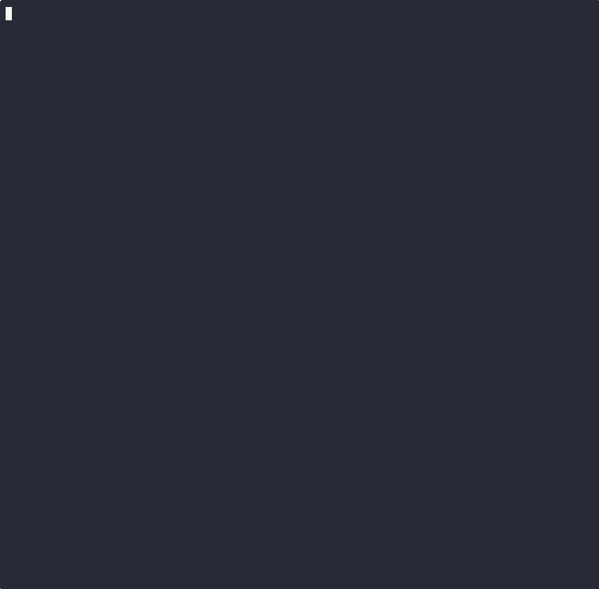

# Customer Support Agent

This example walks through a realistic enterprise support pipeline: multiple agents
share a session, commit text and product photos to memory, and retrieve context
across tickets using both metadata filters and CLIP semantic image search.



---

## What This Example Shows

- **Multi-agent sessions** — a senior agent and an AI triage agent each hold
  their own `Context` into the same support ticket session
- **Multimodal commits** — text notes and product photos committed together via
  `process_and_commit()` so both are searchable
- **Graph connectivity** — every commit creates a `NexusCommit` entity linked to
  its context, user, and content; the knowledge graph is built automatically
- **CLIP semantic image search** — a text query ("scratched product") retrieves
  the most visually similar damage photos across all tickets

The schema below shows the graph aperture-nexus builds in ApertureDB as entries
are committed:


Each `NexusUser` is connected to the `NexusContext` they authored. Each
`NexusContext` is connected to its `NexusCommit` (for precise removal) and
directly to every content entry (blob, image) for fast traversal. All edges
are created atomically with the content — there is no separate graph-building
step.

---

## Setup

```python
import os
from aperture_nexus import Memory, Context, Information, NexusAdmin, generate_session_id

# Connect to local Docker stack (docker compose up -d)
if not os.environ.get("APERTUREDB_KEY"):
    os.environ["APERTUREDB_JSON"] = (
        '{"host":"localhost","port":55556,'
        '"username":"admin","password":"admin","use_ssl":false}'
    )

admin  = NexusAdmin()
memory = Memory()
```

---

## Provision Principals

Each participant — human agents, AI triage bot — gets their own Principal. The
admin creates them once; principals authenticate with an API key.

```python
ORG  = "acme-corp"
DEPT = "support"

def create_principal(user_id, user_name):
    return admin.create_principal(
        user_id=user_id,
        user_name=user_name,
        organization=ORG,
        department=DEPT,
    )

alice_key = create_principal("alice-support", "Alice Chen")
ai_key    = create_principal("ai-triage",     "AI Triage Agent")

alice = memory.authenticate(user_id="alice-support", api_key=alice_key)
ai    = memory.authenticate(user_id="ai-triage",     api_key=ai_key)
```

---

## Open a Shared Support Ticket Session

A single session ID is shared across all participants. Each participant
opens their own `Context` into that session, which becomes a node in
the knowledge graph connected to their user entity.

```python
sid = generate_session_id(prefix="ticket")

ctx_alice = Context(
    principal=alice,
    session_id=sid,
    purpose="Surface scratch — SkyDock Pro lid — pre-shipping",
    organization=ORG,
)

ctx_ai = Context(
    principal=ai,
    session_id=sid,
    purpose="AI triage — SkyDock Pro defect analysis",
    organization=ORG,
)
```

---

## Agent 1 — Alice Logs the Customer Report

Alice's context buffers text notes and product photos locally. Nothing
touches ApertureDB until `process_and_commit()` is called.

```python
info_alice = Information(context_id=ctx_alice.id)

info_alice.log(text="Customer received SkyDock Pro with a diagonal scratch across the full lid.")
info_alice.log(text="Unit was new in sealed original box. Damage is pre-shipping.")
info_alice.log(
    text="Photo attached — scratch visible running lid end to end.",
    image=scratch_photo_bytes,   # PIL Image, numpy array, path, or bytes
)

commit_id = memory.process_and_commit(ctx_alice, info_alice)
print(f"Alice committed  ·  commit_id: {commit_id[:16]}…")
```

`process_and_commit()` generates CLIP embeddings for the image and text embeddings
for the notes, then writes everything to ApertureDB in one atomic operation per
entry. The graph looks like this after Alice's commit:

```
NexusUser(alice) ──nexus_user_context──► NexusContext(ctx_alice)
                                               │
                               nexus_context_commit ──► NexusCommit(commit_id)
                                               │                  │
                               nexus_context_entry        nexus_commit_entry
                                               │                  │
                                               └──────────────────┘
                                                        ▼
                                               Image + Blob (text chunk)
```

---

## Agent 2 — AI Triage Adds Its Analysis

The AI triage agent commits to the same session but its own context,
so its contribution is attributed separately in the graph.

```python
info_ai = Information(context_id=ctx_ai.id)

info_ai.log(text="Scratch pattern consistent with conveyor belt contact. Not a customer-caused defect.")
info_ai.log(text="Recommend: replacement unit + escalate to QA for batch review.")

memory.process_and_commit(ctx_ai, info_ai)
print("AI triage committed")
```

---

## Retrieve the Full Ticket

Searching by `session_id` returns all contributions from all participants
in that session, regardless of which context they came from.

```python
results = memory.search(filters={"session_id": sid})

for r in results:
    print(f"[{r.modality}]  {r.user_id}:  {r.text or '(image)'}")
```

```
[text]   alice-support:  Customer received SkyDock Pro with a diagonal scratch…
[text]   alice-support:  Unit was new in sealed original box…
[image]  alice-support:  (image)
[text]   ai-triage:      Scratch pattern consistent with conveyor belt contact…
[text]   ai-triage:      Recommend: replacement unit + escalate to QA…
```

---

## Semantic Image Search Across Tickets

With CLIP embeddings indexed, a text query can retrieve visually similar
damage photos across all sessions — not just the current ticket.

```python
# Find the most visually similar damage photos to this text description
results = memory.search(
    query="scratched product surface damage",
    modality="image",
    k=5,
)

for r in results:
    print(f"score: {r.score:.3f}  session: {r.session_id}  user: {r.user_id}")
```

This returns photos from any session where `process_and_commit()` was called —
scratch, flaking, discoloration, or crack damage — ranked by visual similarity
to the query text. A text query can find image results; an image query can
find similar images in other sessions.

---

## Search by Purpose

`search_contexts()` finds sessions by the *intent* behind them — useful when you
want to surface related tickets without knowing their session IDs.

```python
related = memory.search_contexts(
    "surface damage pre-shipping",
    filters={"organization": ORG},
    k=5,
)

for r in related:
    print(f"score: {r.score:.3f}  session: {r.session_id}  purpose: {r.purpose}")
```

---

## Clean Up

```python
memory.remove(session_id=sid)
admin.delete_principal(user_id="alice-support")
admin.delete_principal(user_id="ai-triage")
```

`remove(session_id=sid)` deletes all blobs, images, text chunks, descriptors,
`NexusCommit`, `NexusContext`, and `NexusSession` entities for the session in
one call.

---

## Key Patterns

| Pattern | How it works |
|---------|-------------|
| Multi-agent on one ticket | Shared `session_id`, separate `Context` per participant |
| Attribution | Every entry is linked to its context and its user in the graph |
| Precise rollback | `commit_id` returned by `process_and_commit()` — pass to `remove(commit_id=...)` to undo exactly one commit |
| Fast context search | Direct `NexusContext → entry` edges bypass `NexusCommit` for traversal |
| Semantic image retrieval | CLIP embeddings indexed at commit time; text or image queries at search time |
| Organization scope | Set `organization=` on `Context` to filter results to one tenant |

---

## Full Runnable Example

The full script — with seeded org knowledge across three agents, damage photo
generation, and the live CLIP demo — is in
[`demo/customer_support_demo.py`](https://github.com/aperturedata/aperture-nexus/blob/main/demo/customer_support_demo.py).

Run it against a local Docker stack:

```bash
docker compose up -d
python demo/customer_support_demo.py
```
